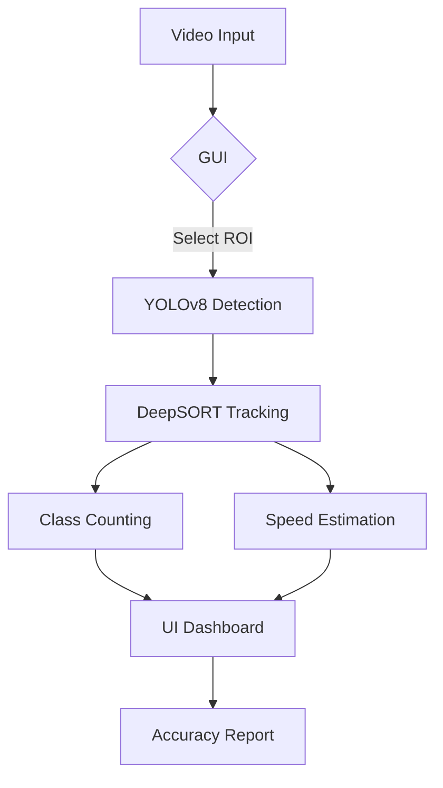
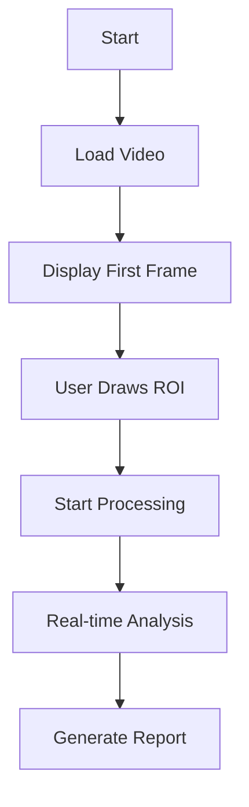
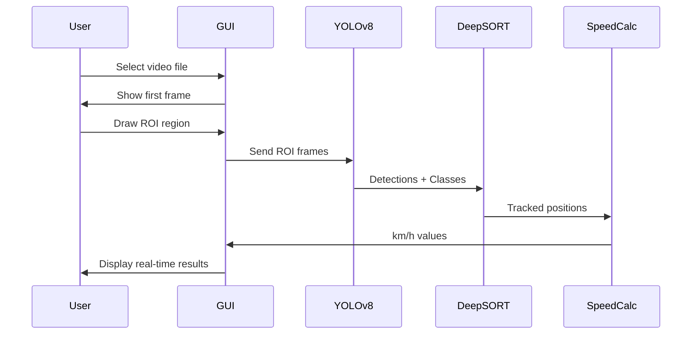
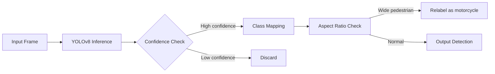
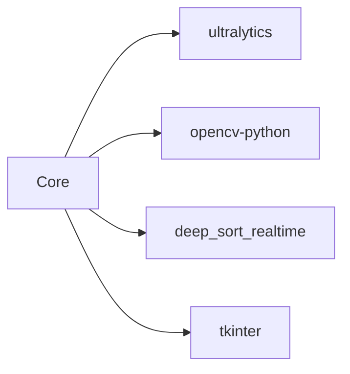

# 🚦 Vehicle & Pedestrian Detection System
[](https://python.org)
[](https://ultralytics.com/yolov8)
```markdown
> Real-time detection, tracking, counting, and speed estimation for traffic analysis
> Automated traffic analysis is crucial for intelligent transportation systems.
> Traditional methods rely on background subtraction and handcrafted features, which struggle in complex scenes.
> Recent advances in deep learning particularly one-stage detectors like YOLO and two-stage detectors like Faster R-CNN have dramatically improved detection accuracy and speed.
> In this work, I build a pipeline that not only detects and classifies vehicles (cars, motorcycles, trucks, pedestrians, others) but also tracks each instance to avoid double-counting and estimates its speed via pixel-to-real-world conversion.
```
## Demo 
### Live
https://github.com/user-attachments/assets/7f4edabe-5977-4637-bc1b-d75dcba9bd3e 

### For download
Click -> [⬇️Download](/DEMO/Demo_Video.mp4)
## 🌟 Key Features
- 🎯 **YOLOv8 Object Detection** - Nano variant for real-time performance
- 🔄 **DeepSORT Tracking** - Persistent object IDs with no double-counting
- 📏 **Pixel-to-Speed Conversion** - Real-time km/h estimation
- 🖱️ **Interactive GUI** - Tkinter-based ROI selection
- 📊 **Class-wise Counting** - Vehicles, pedestrians, motorcycles, trucks
- 📈 **Accuracy Reporting** - Automatic JSON report generation

## 📦 Installation
```bash
git clone https://github.com/nouman-x-ahmad/Vehicle-and-Pedestrian-Detection-Count
cd Vehicle-and-Pedestrian-Detection-Count/Code
pip install -r requirement/requirements.txt
```

## 🚀 Usage
```bash
python main.py
```
### 🪜 Workflow
```markdown
> Select MP4 video file
> Draw ROI region on first frame
> System processes video in real-time
> View counts and speeds in output window
```
## 🧠 System Architecture


## 🔧 Modules Overview

### 🖼️ GUI Interface


### ⚙️ Processing Pipeline


### 🔍 Detection Workflow


## 📊 Class Mapping Table
| COCO ID | Original Class | Mapped Class | Confidence Threshold | Special Handling |
|---------|----------------|--------------|----------------------|------------------|
| 0       | Person         | Pedestrian   | 0.3                  | None |
| 1       | Bicycle        | Motorcycle   | 0.2                  | Lower threshold |
| 2       | Car            | Car          | 0.3                  | None |
| 3       | Motorcycle     | Motorcycle   | 0.2                  | Lower threshold |
| 5       | Bus            | Truck        | 0.3                  | Relabel |
| 7       | Truck          | Truck        | 0.3                  | None |
| Others  | Any            | Rest         | 0.3                  | None |

## 📐 Speed Calculation Formula
Speed (km/h) is calculated using:

```math
v = \frac{\Delta_{\text{pixels}} \times \text{scale}}{\Delta t} \times 3.6
```
Where:
- `Δ_pixels` = Distance traveled in pixels
- `scale` = 1/√(8×20) ft/pixel (conversion factor)
- `Δt` = Time between frames (seconds)
- `3.6` = Conversion factor from m/s to km/h

## 📝 Sample Output Report
```json
{
  "car": {
    "predicted": 42,
    "ground_truth": 40,
    "accuracy_pct": 95.0
  },
  "truck": {
    "predicted": 8,
    "ground_truth": 8,
    "accuracy_pct": 100.0
  }
}
```

## 🚧 Future Work

- **Future Improvements:**
  - Automatic scale calibration
  - Multi-camera support
  - Web-based interface (Flask)
  - Pedestrian trajectory analysis

## 📚 Dependencies


## 🙏 Credits
Developed by [Nouman Ahmad](https://github.com/nouman-x-ahmad)
```
This project is licensed under the MIT License - see the LICENSE file for details.
